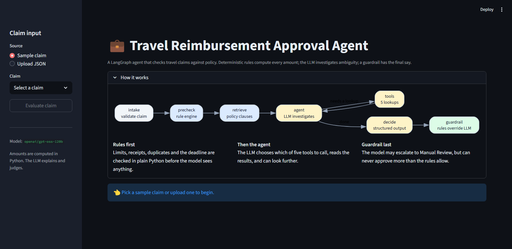
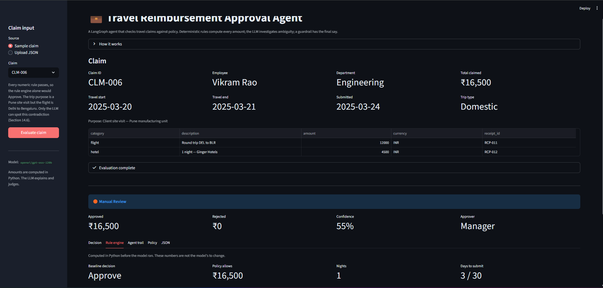
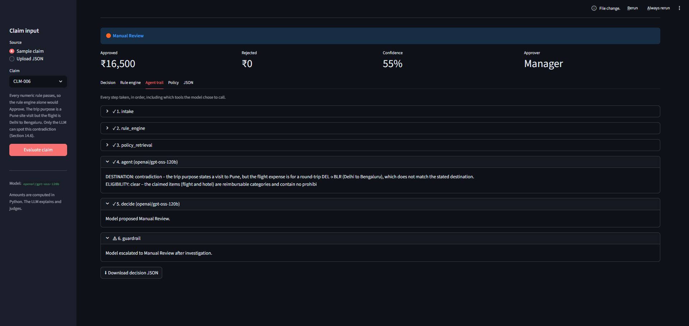
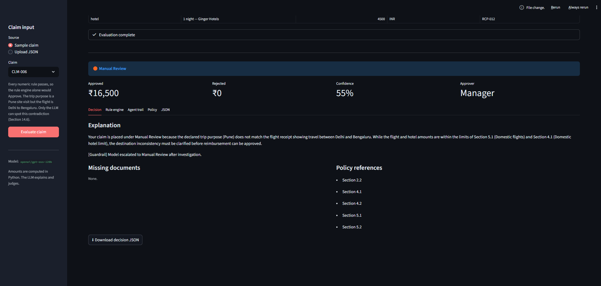
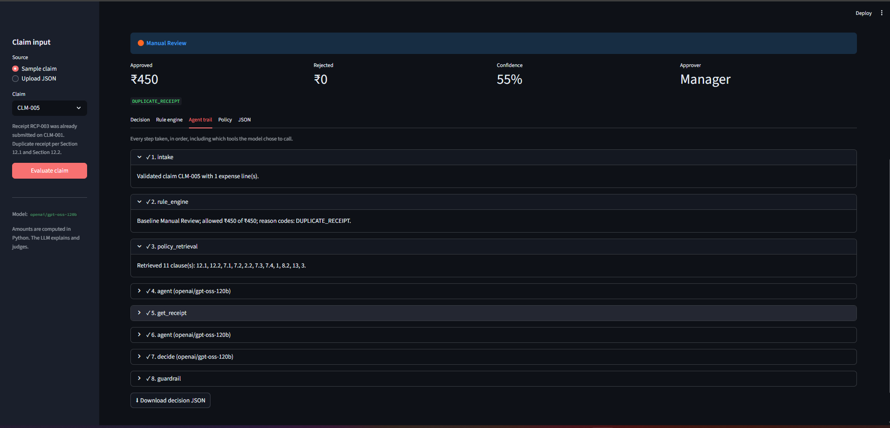
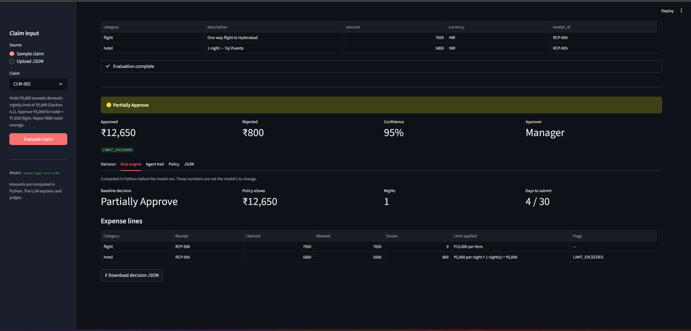

# Travel Reimbursement Approval Agent

A LangGraph agent that reviews employee travel expense claims against a company
policy and returns a structured decision: **Approve**, **Partially Approve**,
**Reject** or **Manual Review**.

The central design choice: **deterministic Python computes every amount; the
LLM investigates ambiguity and explains the outcome; a guardrail has the final
say.** Language models are unreliable at arithmetic and date maths, and good at
judgement and explanation. This splits the work along that line.

**[Try it live](https://travel-reimbursement-agent-uhti5rhgltsnmgchgjqc5y.streamlit.app/)** — pick CLM-006 to see the case where every number is
correct and only reading the free text catches the problem. A claim takes 30
seconds to a few minutes, and the free tier allows about 200,000 tokens a day
across all visitors, so it may report that the model was unavailable if the
budget is spent. It degrades to Manual Review rather than failing.

---

## Architecture

```
intake ──▶ precheck ──▶ retrieve ──▶ agent ⇄ tools ──▶ decide ──▶ guardrail ──▶ END
           (rules)      (policy)     (LLM chooses)      (LLM)      (rules win)
```

| Node | Does | Runs on |
|---|---|---|
| `intake` | Validates the claim against a Pydantic schema | Python |
| `precheck` | Limits, receipts, duplicates, deadline, approver | Python |
| `retrieve` | Fetches applicable policy clauses | FAISS + exact lookup |
| `agent` ⇄ `tools` | Model chooses lookups, reads results, may look further | LLM |
| `decide` | Produces decision label, explanation and citations | LLM |
| `guardrail` | Reconciles model against rules, assembles final output | Python |

Three properties fall out of this shape:

- **`precheck` always runs.** A model cannot skip a safety check by deciding it
  is unnecessary.
- **The guardrail is asymmetric.** The model may escalate a claim toward Manual
  Review. It can never approve more than the rules allow, and never clears a
  blocking issue on its own. If model and rules disagree, a human looks.
- **It fails safe, not open.** If the LLM is unavailable or rate-limited, the
  amounts are still computed, rule-determined rejections still stand, but
  anything approvable goes to a human rather than being auto-approved.

---

## Results

Measured by `evals/run_eval.py` on `openai/gpt-oss-120b`. LLM output varies
between runs even at temperature 0, so the eval was run repeatedly rather than
once:

| Metric | Result | Varies between runs? |
|---|---|---|
| Amount accuracy | 3/3 every run | No — computed in Python |
| Citation validity | 7/7 every run | No — verified against retrieved text |
| Decision accuracy, rule-decidable | 5/5 | Rarely |
| Decision accuracy, needs LLM judgement | 2/2 | Yes — this is the soft part |

A single run is not evidence. The first three-run batch scored 5/7, 6/7 and
7/7, and the two failures were worth more than the passes — see
[Two things repeat runs caught](#two-things-repeat-runs-caught) below.

| Claim | Scenario | Decided by | Outcome |
|---|---|---|---|
| CLM-001 | Everything within policy | rules | Approve |
| CLM-002 | Hotel over the nightly limit | rules | Partially Approve |
| CLM-003 | Submitted 45 days after travel | rules | Reject |
| CLM-004 | Receipt attachment missing above ₹500 | rules | Manual Review |
| CLM-005 | Receipt already used on an earlier claim | rules | Manual Review |
| CLM-006 | Trip purpose says Pune, flight is DEL→BLR | **LLM** | Manual Review |
| CLM-007 | "wine and cocktails" needs pre-approval (§6.3) | **LLM** | Manual Review |

CLM-006 and CLM-007 exist to answer the obvious question: *why have an LLM at
all?* Both pass every numeric rule, so the rule engine alone would approve them.
Only reading the free text catches the problem. The eval scores them separately
so that contribution is visible rather than assumed.

Full decision files for all seven claims are in [`outputs/`](outputs/).

---

## Screenshots

**The architecture.** Blue nodes are deterministic Python, amber is the LLM,
green is the guardrail that has the final say.



### What the LLM adds

CLM-006 is the case worth looking at twice. Every numeric rule passes, so the
rule engine alone reaches **Approve** — visible in the Rule engine panel:



The model then reads the free text and finds what the rules cannot: the trip
purpose is a Pune site visit, but the flight is Delhi to Bengaluru. It reports
`DESTINATION: contradiction`, and the guardrail escalates:



The banner says Manual Review while the baseline still says Approve. Both stay
on screen on purpose: that gap is exactly what the LLM contributed, and hiding
it would make the agent unauditable.

The employee-facing explanation, with only verified citations:



### The agent loop

Step 4 calls a tool, step 5 runs it, step 6 reads the result and continues.
That is the agentic part — the model chooses what to investigate rather than
following a fixed script.



### Rules compute the money

Per-line claimed, allowed and excess amounts, with the limit that was applied
and why. None of these numbers come from the model.



---

## Quickstart

```bash
pip install -r requirements.txt

cp .env.example .env        # then add your Groq API key
python -m rag.vector_store  # build the FAISS index (~30s, first run only)

streamlit run streamlit_app.py
```

A free Groq API key comes from [console.groq.com/keys](https://console.groq.com/keys).

### Environment variables

| Variable | Default | Purpose |
|---|---|---|
| `GROQ_API_KEY` | — | Required |
| `GROQ_MODEL` | `openai/gpt-oss-120b` | Must support native tool calling |
| `GROQ_FALLBACK_MODEL` | `openai/gpt-oss-20b` | Used if the primary is rate-limited |
| `EMBEDDING_MODEL` | `sentence-transformers/all-MiniLM-L6-v2` | Runs locally |
| `MAX_AGENT_STEPS` | `8` | Ceiling on tool-calling iterations |

> Groq retired the Llama chat models, so `llama-3.3-70b-versatile` no longer
> resolves. `openai/gpt-oss-120b` and `-20b` were both verified to do native
> tool calling through `ChatGroq.bind_tools`.

### Tests and evaluation

```bash
pip install -r requirements-dev.txt   # adds pytest to the runtime deps

pytest tests/ -q             # 71 tests, no API key needed
python -m evals.run_eval     # full agent over the golden set (~5 min, uses API)
python -m evals.run_eval --claim CLM-002
```

The unit tests need no API key because the rule engine contains no AI. That is
the point of separating them.

The eval excludes runs where the LLM never answered, usually a free-tier rate
limit, and says so rather than scoring them. Counting them would be actively
misleading: the fail-safe routes an unanswered claim to Manual Review, which is
the expected result for the two judgement cases, so they would appear to pass
without the model having reasoned at all.

---

## The tools

Five read-only lookups. None of them decide anything or compute money — the
rule engine has already done that before the agent runs. They exist so the
model can check its reasoning against source data instead of guessing.

| Tool | Returns |
|---|---|
| `search_policy` | Semantically relevant policy clauses |
| `get_policy_section` | Exact text of one clause, e.g. `4.1` |
| `get_receipt` | Vendor, date, amount, category, attachment status |
| `find_claims_using_receipt` | Every claim using a receipt, with dates |
| `get_category_limits` | The caps for one expense category |

---

## Design choices and trade-offs

**Rules compute, the model explains.** Approved and rejected amounts, reason
codes and the required approver all come from `agent/rules.py`. The model
receives them as verified facts it may not contradict. The cost is that adding
a policy rule means writing Python, not editing a prompt. That is the right
trade for money decisions.

**Retrieval is hybrid, not pure vector search.** The rule engine already knows
which clauses it applied, so those are fetched directly by section id — no
embedding search, no chance of missing the clause that actually decided the
claim. Semantic search is used only for what rules cannot judge: unusual
descriptions, unfamiliar categories, the non-reimbursable list.

**Chunking follows the document, not a character count.** The policy splits
into 46 chunks, one per numbered clause, each tagged with its section id. That
id is what makes a citation checkable.

**Citations are verified, not trusted.** Anything the model cites is checked
twice: does the section exist, and was it actually retrieved? A real section
the model never read is rejected the same as an invented one.

**Confidence is computed, not asked for.** 0.95 when model and rules
independently agree, 0.55 when they disagree or the model was unavailable,
capped at 0.60 for Manual Review, reduced for unverifiable citations. A
model's self-reported confidence carries no information about correctness.

**FAISS is arguably overkill** for a six-page policy that would fit in the
prompt. It is kept because it makes citations verifiable and because the
approach still works on an eighty-page policy, but on size alone the simpler
choice would be to skip it.

### Two things repeat runs caught

**Vague instructions get vague compliance.** Early on the model escalated
almost everything, reasoning that *"the receipt does not prove there was no
alcohol"* — true, and true of every claim ever filed. Telling it to "escalate
only on positive evidence" helped but was still interpreted loosely. What
actually worked was removing the judgement call. The agent must now end every
investigation with a filled-in form:

```
DESTINATION: <consistent | contradiction>
ELIGIBILITY: <clear | concern>
```

and the decision step has an explicit list of what is and is not grounds for
Manual Review, including the exact phrasings to reject ("we cannot confirm
that...", "it is unclear whether..."). A model cannot skip a check it is
required to answer. That moved the destination case from 1/3 to 3/3.

**The system used to fail open.** On one run a Groq call failed, the guardrail
fell back to the rules baseline, and a claim containing alcohol was approved —
because the only layer that can notice alcohol never ran. Amounts and reason
codes were all correct; the claim was simply approved for the wrong reason.

An outage now routes anything approvable to Manual Review. Rule-determined
rejections still stand, and the amounts are still computed either way. A system
that releases money should not treat "the model timed out" as "nothing was
wrong". `tests/test_graph.py` has a regression test named after this.

Both were found by running the eval three times rather than once.

**A third one, found by timing a run node by node.** Claims were taking around
seven minutes. The suspicion was LLM latency; the trace showed 180 of the 408
seconds went on loading the embedding model *twice* — `graph.py` constructed its
own `PolicyRetriever` and `tools.py` had a separate module-level one, so the
first `search_policy` call reloaded everything from disk. They share one
instance now. The remaining per-call time turned out to be Groq's free-tier
queue, which no amount of code could change. Worth stating plainly: two of the
three fixes attempted here (sticky model fallback, lower reasoning effort) made
no measurable difference, and only measurement showed which one mattered.

---

## Project structure

```
agent/
  config.py      paths, model names, step ceiling
  rules.py       the deterministic rule engine — all money logic
  tools.py       five read-only tools the agent can call
  prompts.py     agent and decision prompts, fact formatting
  graph.py       the LangGraph workflow and the guardrail
rag/
  loader.py      section-aware policy chunking
  vector_store.py FAISS build and load
  retriever.py   exact lookup, semantic search, citation checking
models/
  schema.py      Pydantic contracts, including reason codes
data/            policy, limits, approval matrix, receipts, sample claims
evals/run_eval.py  scores decisions, amounts and citations
tests/           71 tests, no API key required
outputs/         generated decisions and eval summary
```

---

## Assumptions and simplifications

- Mock data only. No real employee or company information.
- All amounts are INR. A claim mixing currencies is routed to Manual Review
  rather than converted, since no rate source is wired in.
- Duplicate detection compares against `data/sample_claims.json` standing in
  for a claims database. The later submission is flagged, the original is not.
- Hotel nights are derived from the trip dates, not from per-night line items.
- Receipts are metadata records, not images. Nothing is OCR'd.
- Per-day limits use the receipt's date when the expense line has none.
- `expected_*` fields live inside the sample claims for convenience. Real
  intake would not carry them, and the agent never reads them.

## Known gaps

- **Non-reimbursable detection (§13) depends entirely on the LLM.** There is no
  deterministic keyword check, so an obfuscated description could slip past.
- **The judgement cases are not deterministic.** CLM-006 and CLM-007 rely on
  the model noticing something. They pass consistently now, but "consistently"
  is not "always" — the rule-based claims are reproducible in a way these are
  not, and the eval reports them separately for that reason.
- **The golden set is small.** Seven claims is enough to catch regressions, not
  enough to measure accuracy meaningfully. Three repeat runs is also a small
  sample for judging variance.
- **A missing API key changes the answer, not just the confidence.** Failing
  safe means an outage turns approvable claims into Manual Review. That is the
  right trade for money, but it does mean availability affects throughput.
- **A run takes 30 seconds to several minutes**, almost entirely Groq free-tier
  latency. Measured directly: a 78-token prompt returning 36 tokens took 44
  seconds, and a 3,280-token prompt took the same. Prompt size, model choice and
  `reasoning_effort` made no difference, so it is queueing rather than
  generation, and nothing in this repo can fix it. Earlier in the week the same
  calls took about 5 seconds. A claim makes 2–6 calls depending on how much the
  agent investigates.
- **Deployment needs Python 3.12, set in the Streamlit Cloud dashboard.** Its
  default build image used Python 3.14, where `pyarrow` (a Streamlit
  dependency) has no wheel and falls back to compiling from source against a
  `cmake` that is not installed. `runtime.txt` does not control this — Streamlit
  Cloud reads the version from its own settings, not that file.
- **The free tier allows 200,000 tokens per day.** A single claim costs roughly
  5,000–15,000 tokens across the agent loop, its tool calls and the decision
  step, so the whole golden set is about 60,000. That is fine for development
  but means a public demo link can exhaust the day's budget after a few dozen
  evaluations, at which point every claim degrades to Manual Review. Serving
  cached decisions for the sample claims, and reserving live runs for uploads,
  would fix it.
- **No persistence.** Nothing is written back, so a Manual Review outcome has
  nowhere to go.
- **Prompt injection is untested.** An expense description is attacker-controlled
  text that reaches the model. The guardrail limits the damage — injection
  cannot increase an approved amount — but it could influence the explanation.

## What I would do next

1. **Adversarial evals.** Prompt injection in description fields, mismatched
   dates, currency mixing. The guardrail should hold; that needs proving.
2. **Receipt images.** Extract vendor, date and amount from an uploaded photo
   and cross-check against the claim. Groq currently has no vision model, so
   this needs a second provider.
3. **Natural-language intake.** Paste an expense email, get a structured claim.
4. **A deterministic §13 check** so non-reimbursable categories do not rest on
   the model alone.
5. **Tracing.** Langfuse or LangSmith over the graph, to see cost and latency
   per node.
6. **Expand the golden set** to 30–50 claims and compare models on it.

---

*Policy, claims and receipts in `data/` are mock data for demonstration only.*
